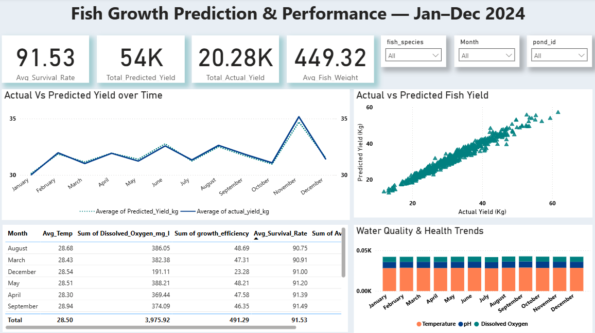

# 🐟 Fish Growth Prediction & Performance Dashboard (Jan–Dec 2024)

## 📊 Project Overview
This project leverages **Excel**, **Python**, and **Power BI** to analyze and predict fish growth performance across multiple ponds and species.  
It focuses on **monitoring water quality**, **predicting fish yield**, and **optimizing aquaculture management** using real-world data.

The insights empower aquaculture managers to make data-driven decisions that improve yield, survival rate, and resource efficiency.

---

## 🧠 Tools & Technologies Used
- **Excel** – Data cleaning, preprocessing, and validation  
- **Python** – Predictive modeling using regression and data analysis with pandas & matplotlib  
- **Power BI** – Interactive dashboard creation and visual storytelling  
- **SQL** *(optional if connected to source data)* – Data querying and integration  

---

## 🚀 Key Insights
- 🧬 **Average Survival Rate:** 91.53%  
- 🐠 **Total Predicted Yield:** 54K  
- ⚖️ **Average Fish Weight:** 449.32g  
- 🌡️ **Monitored Parameters:** Temperature, pH, and Dissolved Oxygen  
- 📈 Strong correlation between **Predicted Yield** and **Actual Yield**  
- 🔍 Seasonal variation observed in **growth efficiency** and **survival rate**

---

## 📉 Dashboard Features
- **Actual vs Predicted Yield Trend:** Compare real vs forecasted growth performance  
- **Pond-level Filters:** Drill down by month, pond ID, or fish species  
- **Water Quality Indicators:** Visualize dissolved oxygen, temperature, and pH trends  
- **Interactive KPIs:** Highlight the metrics that drive sustainable aquaculture  

---

## 🧩 Project Workflow
1. **Data Preparation (Excel):** Cleaned and structured pond data  
2. **Predictive Analysis (Python):** Modeled fish growth using regression techniques  
3. **Visualization (Power BI):** Designed an interactive report for data storytelling  

---

## 📸 Dashboard Preview

---

## 💡 Business Impact
This project demonstrates how **data analytics and predictive modeling** can help optimize aquaculture productivity by identifying:
- Environmental conditions affecting growth  
- The gap between predicted and actual performance  
- Actionable insights for better pond management  

---

## 🧑‍💻 Author
**Okafor Chukwuka**  
*Senior Data Analyst | Data Scientist | Power BI & Python Expert*  

---

## 🏷️ Tags
`#DataAnalytics` `#PowerBI` `#Excel` `#Python` `#Aquaculture` `#MachineLearning` `#PredictiveAnalytics` `#DashboardDesign`
